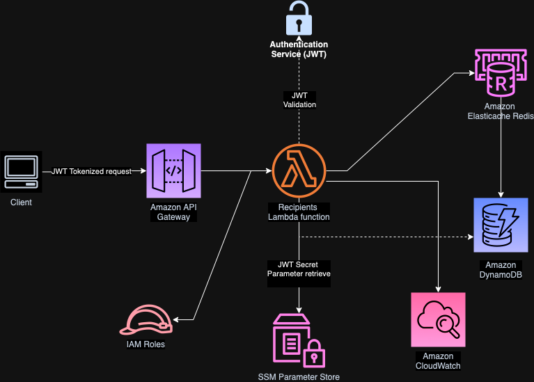

# Recipients Project v.1.0

[](https://sonarcloud.io/summary/new_code?id=jcondotta_bank-account-recipients)
[](https://sonarcloud.io/summary/new_code?id=jcondotta_bank-account-recipients)

This project is part of a microservice architecture responsible for managing bank account recipients. The service provides RESTful APIs for creating, fetching, and deleting recipient information. The system leverages various AWS services and modern software development practices to ensure scalability, security, and maintainability.

## Tech Stack

### Languages & Frameworks:

- **Java 17:** Core programming language.
- **Micronaut 4.5.0+:** Framework used to build the microservice with lightweight, fast startup times and cloud-native capabilities.

### Infrastructure:

- **Amazon DynamoDB:** NoSQL database used for storing recipient information.
- **AWS Lambda:** Serverless compute platform for running the microservice.
- **AWS API Gateway:** Gateway for exposing and managing the API endpoints.
- **AWS Parameter Store:** Secure storage for environment configuration and secrets such as the JWT secret key.
- **Terraform:** Infrastructure as Code (IaC) tool used for managing AWS resources like DynamoDB, Lambda, and API Gateway.
- **LocalStack:** A fully functional local AWS cloud stack used for local testing of AWS services like DynamoDB and Lambda.

### Authentication:

- **JSON Web Token (JWT):** Used for authentication and authorization to secure API endpoints.

### CI/CD & Containerization:

- **GitHub Actions:** Automated pipeline for building, testing, and deploying the microservice.
- **Docker:** Used to containerize the application for local development and deployment.
- **Docker Hub:** The project’s Docker image is registered in Docker Hub for future deployment and scaling needs.

### Testing:

- **JUnit 5:** Framework for unit and integration testing.
- **Mockito:** Framework for mocking dependencies in tests.
- **AssertJ:** Library for fluent assertion statements.
- **TestContainers:** Library used to spin up containers for integration testing with services like DynamoDB, SQS, and LocalStack.

### Documentation:

- **Swagger API:** API documentation and testing interface to explore the RESTful endpoints.

## Features

- **Recipient Management:** Create, fetch, and delete recipients linked to a bank account.
- **JWT Authentication:** Secure endpoints with JSON Web Tokens.
- **Infrastructure as Code:** AWS infrastructure is managed and deployed using Terraform.
- **Local Testing:** Fully local development setup using JUnit 5, Mockito, AssertJ, LocalStack and TestContainers.
- **CI/CD Pipeline:** GitHub Actions for continuous integration and deployment.

## Project Architecture



## Prerequisites

Before running the microservices or working with the Terraform scripts using LocalStack, make sure you have the following installed:

### Explanation of Key Tools:

- **Java 17**:  
  Required to run your Java-based microservices.  
  You can download and install Java 17 from the [Oracle website](https://www.oracle.com/java/technologies/javase-jdk17-downloads.html) or  
  use an OpenJDK distribution such as: [AdoptOpenJDK](https://adoptium.net/temurin/releases/?version=17).  
  To verify installation, run the following command:
  ```bash
  java -version
  ```
- **Maven**:  
  Required to build and manage dependencies for the Java microservices.  
  You can download and install Maven from the [official Maven website](https://maven.apache.org/install.html).  
  To verify Maven installation, run:
  ```bash
  mvn -v
  ```
- **Docker**:  
  Needed to containerize your microservices and run them in isolated environments.  
  You can download and install Docker from the [Docker website](https://docs.docker.com/get-started/get-docker/).  
  To verify Docker installation, run:
  ```bash
  docker --version
  ```
- **Docker Compose**:  
  Helps manage multi-container Docker applications. It's used to orchestrate and run your microservices together locally.  
  Docker Compose comes bundled with Docker Desktop, or you can install it separately by following instructions [here](https://docs.docker.com/compose/install/).  
  To verify Docker Compose installation, run:
  ```bash
  docker-compose --version
  ```
- **Terraform**:  
  An Infrastructure as Code (IaC) tool used for managing cloud infrastructure resources, such as AWS services.  
  You can download and install Terraform from the [official Terraform website](https://developer.hashicorp.com/terraform/install?product_intent=terraform).  
  To verify Terraform installation, run:
  ```bash
  terraform -v
  ```

- **LocalStack**:  
  A fully functional local AWS cloud stack that allows you to develop and test cloud applications offline. 
  It provides a local environment that simulates various AWS services, such as S3, DynamoDB, Lambda, and more.  
  You can install LocalStack using pip.
  ```bash
  pip install localstack
  ```
  Verify Installation: Once installed, you can verify that LocalStack is correctly installed by checking the version:
  ```bash
  localstack --version
  ```

- **tflocal**:  
  tflocal is a wrapper around Terraform that is designed to work with LocalStack.  
  To install tflocal, you can use pip:
  ```bash
  pip install terraform-local
  ```
  Verify that tflocal is installed correctly:
  ```bash
  tflocal -v
  ```

## Getting Started

### 1. **Clone the repository:**

```bash
 git clone https://github.com/jcondotta/bank-account-recipients.git
 cd bank-account-recipients
```

### 2. **Build the project and resolve dependencies**:
```bash
mvn clean install -DskipTests

# If you'd like to build the project and execute all tests, run instead:
mvn clean install
```

### 3. **Configure AWS Credentials for LocalStack**:  
   In order to interact with LocalStack's simulated AWS services, you need to configure a separate AWS profile. This profile will have mock credentials, region, and the LocalStack endpoint.
   <br><br>
   Run aws configure with the LocalStack profile:
   ```bash
   aws configure --profile localstack
   ```  
   Enter the following values when prompted:  
   When running the above command, AWS CLI will prompt you to enter the access key, secret key, region, and output format. Provide the values below:
   ```bash
   AWS Access Key ID [None]: test
   AWS Secret Access Key [None]: test
   Default region name [None]: us-east-1
   Default output format [None]: json
   ```

### 4. **Run the Microservice Locally with Docker Compose**:
  Use Docker Compose to run the microservice along with its dependencies in the background:
```bash
docker-compose up -d
```

### 5. **Build up the infrastructure**
```bash
# Navigate to the terraform directory
cd terraform

# Initialize Terraform with LocalStack
tflocal init

# Apply the infrastructure changes using the development environment-specific variables: 
tflocal apply -var-file="./environments/dev/terraform.localstack.tfvars"

# When all the resources are ready to be created, Terraform will prompt for confirmation before proceeding.   
# To confirm and initiate the creation of the resources, simply type yes when prompted.
```

### 6. **Run the Java Application**:
  Once the infrastructure is ready, run the Java application to start the microservice:

```bash
# Navigate back to the root project directory
cd ..

# Run the following command to start the Bank Account Recipients application
java -cp target/bank-account-recipients-0.1.jar com.jcondotta.recipients.Application

# If everything works correctly, you should see logs similar to the following:
 __  __ _                                  _   
|  \/  (_) ___ _ __ ___  _ __   __ _ _   _| |_ 
| |\/| | |/ __| '__/ _ \| '_ \ / _` | | | | __|
| |  | | | (__| | | (_) | | | | (_| | |_| | |_ 
|_|  |_|_|\___|_|  \___/|_| |_|\__,_|\__,_|\__|
10:47:31.900 [main] INFO  i.m.c.DefaultApplicationContext$RuntimeConfiguredEnvironment - Established active environments: [dev]
10:47:31.901 [main] INFO  i.m.c.DefaultApplicationContext$BootstrapEnvironment - Established active environments: [dev]
10:47:31.934 [main] INFO  i.m.context.DefaultBeanContext - Reading bootstrap environment configuration
10:47:31.993 [main] INFO  i.m.d.c.c.DistributedPropertySourceLocator - Resolved 0 configuration sources from client: compositeConfigurationClient()
10:47:32.033 [main] INFO  c.j.r.factory.aws.SSMClientFactory - Building SSMClient with params: awsCredentials: AwsCredentials(accessKeyId=test), region: us-east-1 and endpoint: Optional[http://localhost:4566]
10:47:32.240 [main] INFO  c.j.r.f.aws.SSMParameterFactory - Fetching JWT signature secret from SSM parameter: /jwt/signature/localstack/secret
10:47:32.303 [main] INFO  c.j.r.f.JwtConfigurationFactory - Configuring JWT secret from SSM Parameter Store: 8YxV***************
10:47:32.465 [main] INFO  io.micronaut.runtime.Micronaut - Startup completed in 720ms. Server Running: http://localhost:8086
```

### 7. Calling REST APIs
  To interact with secure API endpoints, you must first authenticate and obtain a token from the Login API. Follow the steps below:

1. **Authenticate to Obtain a Token**  
    You need to make a POST request to the Login API, providing a username and password. For this test environment, the credentials are predefined as username=default and password=default.
```json
{
  "username": "default",
  "password": "default"
}
```
Using cURL to Make the Request:
```bash
curl -i --request POST \
  --url 'http://localhost:8086/login' \
  -H "Content-Type: application/json" \
  --data-raw '{"username": "default", "password": "default"}'
```
2. **Retrieve the Token**:    
    If the request is successful, the API will respond with a JWT (JSON Web Token). The response will look similar to this:
```json
{
  "access_token":"eyJhbGciOiJIUzI1NiJ9.eyJzdWIiOiJkZWZhdWx0IiwibmJmIjo...",
  "token_type":"Bearer",
  "expires_in":3600,
  "username":"default"
}
```
3. **Store the Token**:        
    Copy and save the access_token from the response. This token will be used for authentication when making requests to protected endpoints.


4. **Use the Token for Subsequent API Calls**
    To access protected endpoints, include the token in the Authorization header as a Bearer token. Here’s an example using cURL:
```bash
curl -i --request POST \
  --url 'http://localhost:8086/api/v1/recipients' \
  --header 'Content-Type: application/json' \
  --header 'Authorization: Bearer <your-access-token>' \
  --data-raw '{
    "bankAccountId": "01920bff-1338-7efd-ade6-e9128debe5d4",
    "recipientName": "My first recipient",
    "recipientIban": "IT49W0300203280114524628857"
  }'
```
